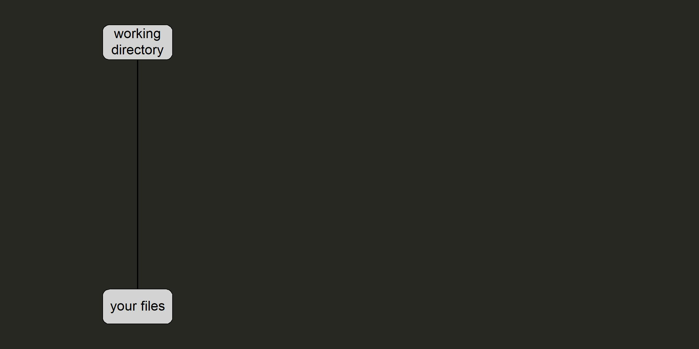
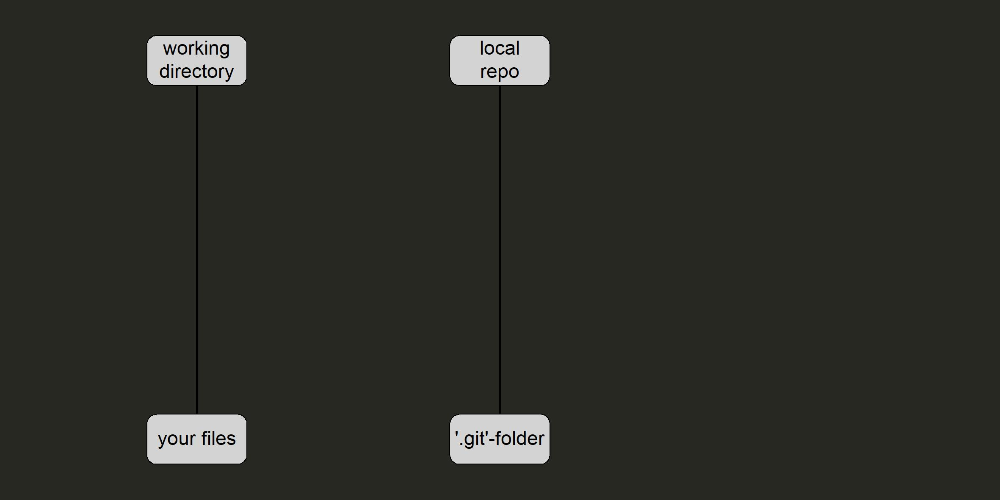
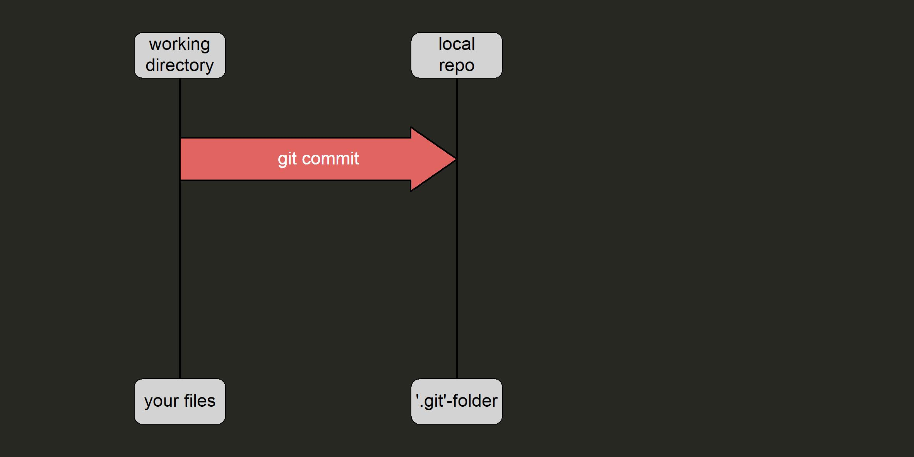
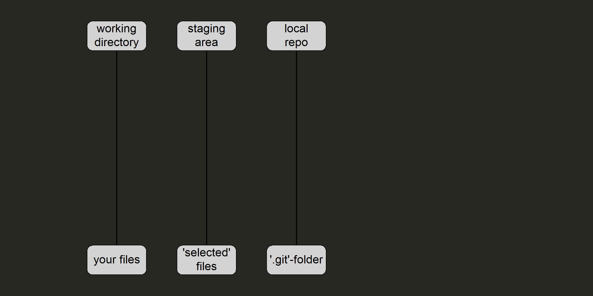
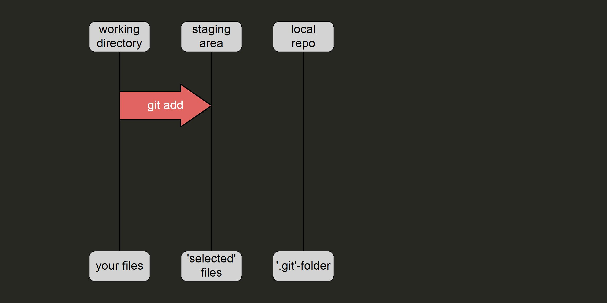
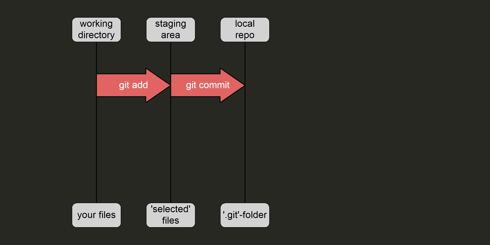
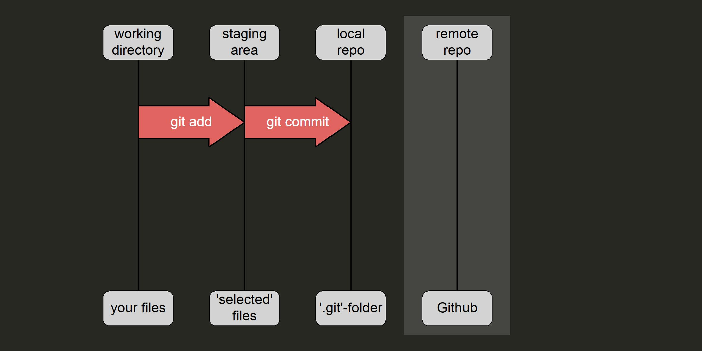
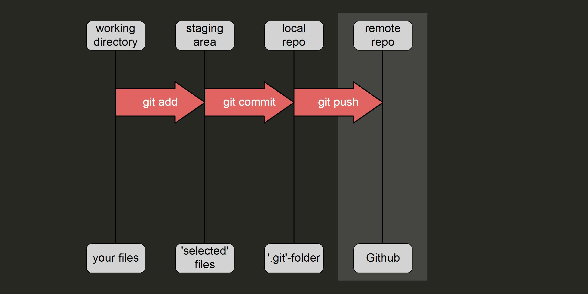
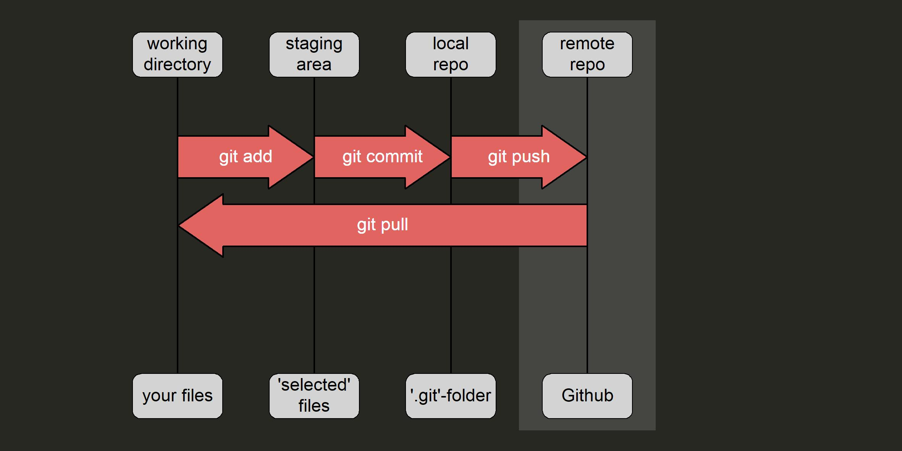
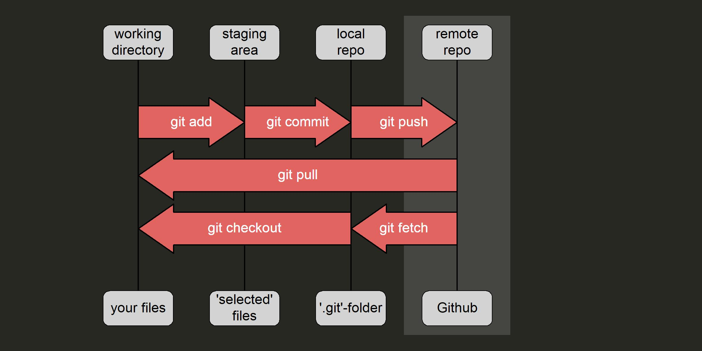

layout: true

# What's your gain from this course?

<!-- https://www.cash.ch/sites/default/files/public/styles/main/public/images/library/woman-3261425_1920.jpg?itok=SekCL_rq&c=73b79c82a262daca25c59646369c8e1f -->
---

---

## We help you tackle the initial hurdles

- Understanding Git's concept
- Getting Git working locally
- Setting up a workflow with Github

---
background-image: url("images/starting_journey.png")
background-position: 50% 70%

.footnote[Image credit: ibaset.com]

???

We only cover a fraction of Git's functionalities
Enough to get you started on a journey

---
layout: false

# What are the missing pieces?

---
layout: true

# What are the  most important  missing pieces?

--

Working with ...

1. ... Git from the commandline  (to go beyond the basics) 
1. ... pulls and merges  (collaboration!) 
<!-- 1. ... Git without RStudio\*   (to be independent) -->
1. ... branches and forks  (Git's *killer features*) 

---

## Git from the commandline

- all clicks in the Git pane evoke *Git* Commands in the background

--

- the same commands can be called directly in the CLI1  (and also switch back-and-forth between the GUI and the CLI) 

.footnote[1 Commandline Interface]

--

- e.g. `git push` pushes your changes to the repo

--

- Most Git tutorials assume you use Git from the CLI

--

- You should familiarize yourself with the most important Git terms

???

We will therefore cover the general git workflow including the terms

---
layout: true

## Git Workflow

---

---

---

---

---

---

---

---

---

---

---

---
class: center, middle

--

... and reaping the benefits of our hard work
 
---

- You have put much effort into learning git
- Many advantages will only reveal themselves with time
- Let's have a look at some advantages you can reap *now*

---

- Combining Rmarkdown with Github pages
- making a pull request to suggest some changes
- 

