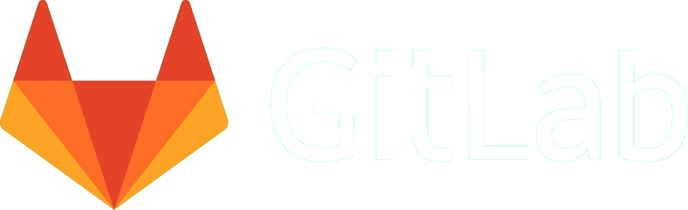

layout: true

# What is this about?

```{r, include=FALSE}
library(fontawesome)
# knitr::opts_chunk$set(dev.args = list(png = list(bg = "transparent")),fig.ext="png")
```


---
class: center, middle


---


In this course you will submit some R-related Materials: 

- two (of five) R-exercises
- one Semester project

--

<br>
<br>
<em class = "center" style = "font-size: 150%;"> We will use git and github for these submissions! </em>

---
layout: true

# Why use `git` for Version Control?

---


class: center, middle, white


background-image: url(images/01_stream_channels_sauk_river_16_9.webp)


---

--

### 1. `r fa("user-lock")`  Safety & Control

--

### 2. `r fa("network-wired")` Collaboration 

--

### 3. `r fa("globe-americas")` Community 


---
layout: true

# Why use `git` for Version Control?


.left-column[
1. <div class = "highlight">`r fa("user-lock")`  Safety & Control </div>
2. `r fa("network-wired")` Collaboration 
3. `r fa("globe-americas")` Community 
]


---

<div  class = "right-column">

<p class = "imgdesc">Credit: Jorge Cham phdcomics.com</p>
<div>

???

A typical project might look something like this. 


---

<div  class = "right-column">

<p class = "imgdesc">Credit: Jorge Cham phdcomics.com</p>
<div>


???


- Which leads to this type of file naming
- However, this type of version control is linear and the changes depend on each other. 
- I.e. if you want to undo the changes in file "data_2010.05.25_huh??.dat", you will have to manually find the difference to the previouse file, and undo this in the newest version of the file.
- This can be somewhat solved by using a software that automates this for you (e.g. Dropbox, GoogleDrive)
 


---


.right-column[
Dropbox, Googledrive *et al.* are not designed for code since files are tracked: 

- individually
- continuously
- uncommented
]


---

.right-column[
With git however, tracking changes is

- <del>individually</del> individually *and* on a project basis
- <del>continuously</del> with "snapshots" (aka "commmits")
- <del>uncommented</del> with comments
]

???

- This allows easier time travel through dependent changes
- Which allows tinkering in a safe way ("camera off")
- you are required to add a comment to a commit, which makes changes easier to understand later on

---


<div  class = "right-column">
<p> Git is your safety rope so that you do not fall (too far) </p>

<p class = "imgdesc">Credit: Carl A, flickr.com</p>
<div>


---
layout: true

# Why use `git` for Version Control?


.left-column[
1. `r fa("user-lock")`  Safety & Control 
2. <div class = "highlight">`r fa("network-wired")` Collaboration </div>
3. `r fa("globe-americas")` Community 
]


<div  class = "right-column">Git makes collaboration smoother</div>
---

.right-column[


Each change is documented with the following information: 
- What changed?
- When did the change happen?
- Who made the change?
- Why was the change made?
]

--

<div  class = "right-column">
Change tracking works online as well as offline
</div>


--

<div  class = "right-column">
Conflicts are rare<sup>1</sup> and very specific<sup>2</sup>
</div>

--

<div class = "right-column" style = "font-size: 80%;">
<sup>1</sup> Conflicts only occur when the *same line* has been changed. <br>
<sup>2</sup> Conflicts are specific to <em>that line </em>

<div>


???

 (there are no "file conflicts" as in dropbox et al)

---
layout: true

# Why use `git` for Version Control?


.left-column[
1. `r fa("user-lock")`  Safety & Control 
2. `r fa("network-wired")` Collaboration 
3. <div class = "highlight">`r fa("globe-americas")` Community </div>
]


<div  class = "right-column">
You get accesss to a great community
</div>
---


--

<div  class = "right-column">
Git is used on <em>many*</em> different hosting platforms <br>
<br>
(e.g. Amazon AWS CodeCommit, Assembla, Beanstalk, Bitbucket, Codebase, Fog Creek Kiln, Download Now for Free, GitHub, GitLab, Launchpad, Microsoft Azure DevOps, Planio, Perforce, RhodeCode, SourceForge)
</div>


<!-- <div  class = "right-column" style = "display: flex"> -->
<!-- <div></div> -->
<!-- <div></div> -->
<!-- <div></div> -->

</div>


--

<div  class = "right-column">
Git != Github
</div>

---

.right-column[
- We will use Github in as a hosting platform in this course
- In addition to hosting Git repos, Github is a social media platform for geeks. You can:
  - `r fa("thumbs-up")` like repos
  - `r fa("binoculars")` follow developers 
  - `r fa("question-circle")` ask questions
  - `r fa("lightbulb")` make suggestions and
  - `r fa("portrait")` build your own portfolio on Github
  
<div></div>

]

---

.right-column[

- Most R-Packages on CRAN are hosted on Github
- Having an account on Github gives us direct access to the package developers

```{r, echo = FALSE, message = FALSE, dpi=300, fig.height=2}

library(ggplot2)
library(readr)
library(dplyr)
read_csv("CRAN_str_detect.csv") %>%
  mutate(domain = fct_reorder(domain, n)) %>%
  ggplot(aes(n, domain)) +
  geom_col(fill = "#F92672") +
  scale_x_continuous(expand = c(0,0)) +
  labs(y = "", x = "", subtitle = "Number of Packages per Domain hosted on CRAN:") +
  theme(panel.grid = element_blank(),
        axis.ticks = element_blank(),
        panel.background = element_rect(fill = "#272822",colour = "#272822"),
        plot.background = element_rect(fill = "#272822",colour = "#272822"),
        legend.position = "none",
        plot.title.position = "plot",
        text = element_text(colour = "#d6d6d6"),
        axis.text = element_text(colour = "#d6d6d6")
        )


```

]

---
layout: true

# A few caveats `r fa("skull-crossbones")`


---
class: center, middle

---

<div class = "quote">
<div>
- Is it going to hurt? <br>
- Yes <br>
<div>
<div style = "quoteauthor">
- Jenny Brian in happygitwithr (2020)
<div>
</div>


